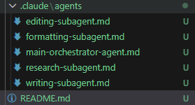

## Overview

### **Main Orchestrator Agent**
The central controller that manages the entire book-writing workflow. It assigns tasks to sub-agents, maintains consistency, and compiles all outputs into a complete manuscript.

### **Research Sub-Agent**
Responsible for gathering factual information, verifying accuracy, and supplying reliable research notes. It ensures realism and supports worldbuilding throughout the book.

### **Writing Sub-Agent**
Creates the first draft of chapters, scenes, dialogue, and narrative content. It follows outlines, research details, and stylistic instructions provided by the Orchestrator.

### **Editing Sub-Agent**
Improves clarity, grammar, structure, tone, and flow while preserving the author’s voice. It polishes the draft into a refined, readable manuscript.

### **Formatting Sub-Agent**
Applies clean, professional formatting to the final manuscript. It ensures proper Markdown structure, spacing, headings, and export-ready layout.

### ***screenshot***   

