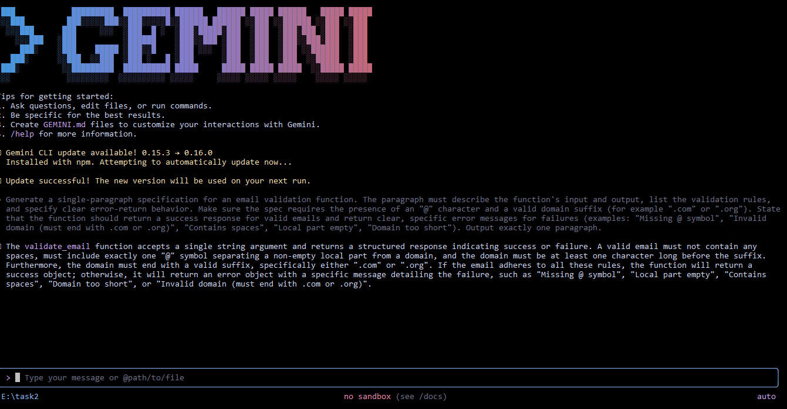

# Nine Pillers Understanding

## Q1:Why is using AI Development Agents (like Gemini CLI) for repetitive setup tasks
better for your growth as a system architect?
1.AI can handes repetitive task setup easily.
2.You can save your time and energy for more creative planning and building system instead if worrying about the several lines of coding. Basically you dont need to code:)
3.You can easily manage and organize complex workflows.

## Q2:Explain how the Nine Pillars of AIDD help a developer grow into an M-Shaped
Developer.
1.The Nine Pillars make hard tasks easier, so developers can learn multiple skills deeply instead of just one.
2.AI tools handle complex steps (coding, config, deployment), letting you build expertise in new areas faster.
3.Universal tools (like AI CLI, MCP, cloud deployment) remove technical barriers that used to require specialists.
4.This helps a developer grow from “T-shaped” (one deep skill) to “M-shaped” (several deep skills).
5.In the end, you can build complete products alone because AI supports learning, quality, and speed across multiple domains.

---

# Vibe Coding vs Specification-Driven Development

## Q3:Why does Vibe Coding usually create problems after one week?
Developers were like No planning which leads to a messy code. 
They skipped or missed the tests, means hidden bugs were still in the code.
Team confusion and fixing problems slowly.
The massive fail is that it takes so much time. Means it can take 34 hours and still your product will have crashes and errors.

## Q4:How would Specification-Driven Development prevent those problems?
1.You write a specification first, defining what you're building, why, and how success looks.
2.Write tests based on that specification, then implement the feature.
3.someone joining the team six months later can read the spec and tests and understand not just what the code does, but why.
4.SDD can complete a feature quickly (e.g. 12 hours in the example), ships reliably, and makes adding new features easy.
5.Prevents crashes, reduces rework and keeps code maintainable.

---

# Architecture Thinking

## Q5:How does architecture-first thinking change the role of a developer in AIDD?
1.AI development now works in three layers: models, IDEs, and agents.
Developers think more about how the system works than just writing code.
The layers give flexibility, control, and make tools work together easily.
Learning theses helps you adapt even when the tools changed.

## Q6:Explain why developers must think in layers and systems instead of raw code?
1.Simply it just means thinking in layers and systems lets developers manage complexity, maintain flexibility, and leverage AI effectively, instead of being tied to a single tool or writing isolated code.

---

# MCQs

| Question | Correct Answer |
|---------|----------------|
| 1. What is the main purpose of Spec-Driven Development? | B. Clear requirements before coding begins |
| 2. What is the biggest mindset shift in AI-Driven Development? | B. Thinking in systems and clear instructions |
| 3. Biggest failure of Vibe Coding? | B. Architecture becomes hard to extend |
| 4. Main advantage of using AI CLI agents? | B. Handle repetitive tasks so dev focuses on design & problem-solving |
| 5. What defines an M-Shaped Developer? | C. Deep skills in multiple related domains |

CLI Propmt Generation Screenshot

