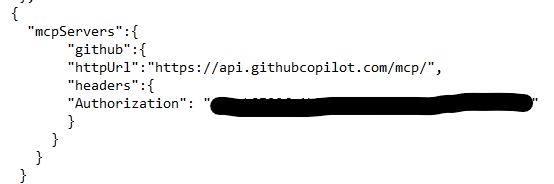
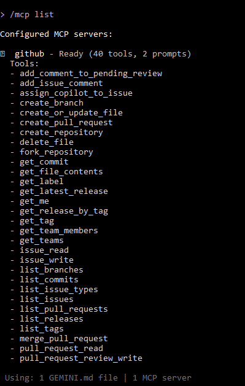
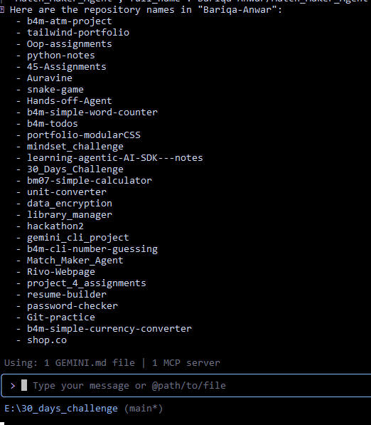

# **Task-6 (Connect GitHub MCP with Gemini CLI)**

## .env 
I've connected the MCP server globally, so there's nothing to configure in the .env file.   
The token is set directly in `.gemini/settings.json`

## settings.json

   

## /mcp list

   

## repositories listed

   

