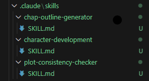

## Overview

### **Chapter Outline Generator**
This skill creates structured, detailed chapter outlines based on story inputs. It organizes the plot using narrative arcs and ensures chapter flow, character progression, and thematic consistency.

### **Character Development Assistant**
This skill helps you build rich, believable characters by generating profiles, motivations, flaws, and full character arcs. It ensures consistency and depth in characterization throughout your story.

### **Plot Consistency Checker**
This tool scans your plot, timeline, and character actions to detect contradictions and logic gaps. It provides actionable fixes to maintain narrative coherence across chapters and scenes.

### ***screenshot***   

